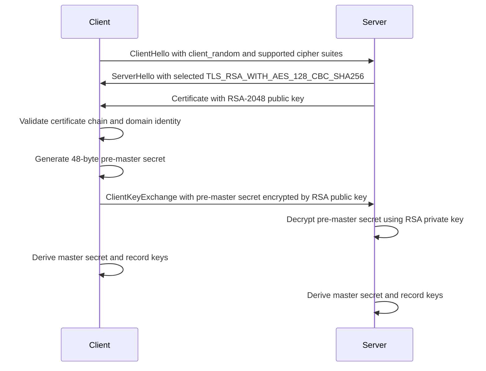
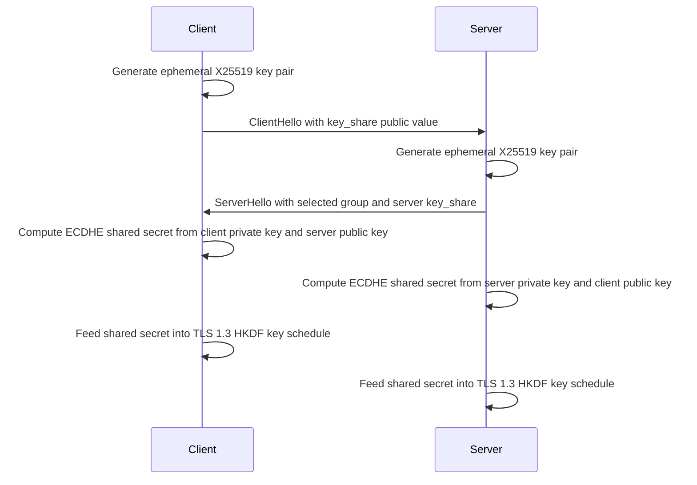
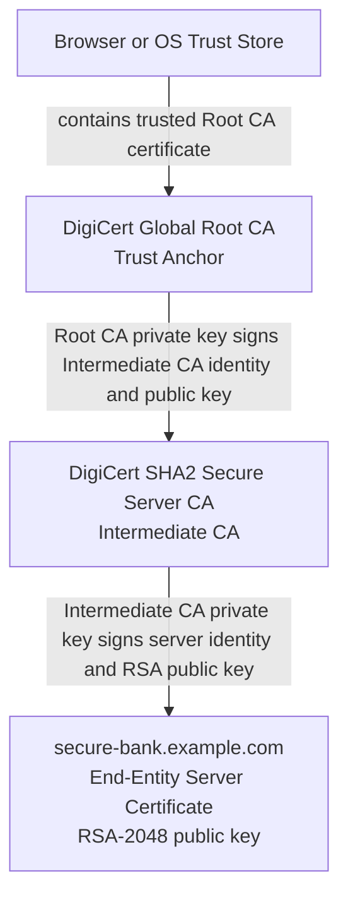
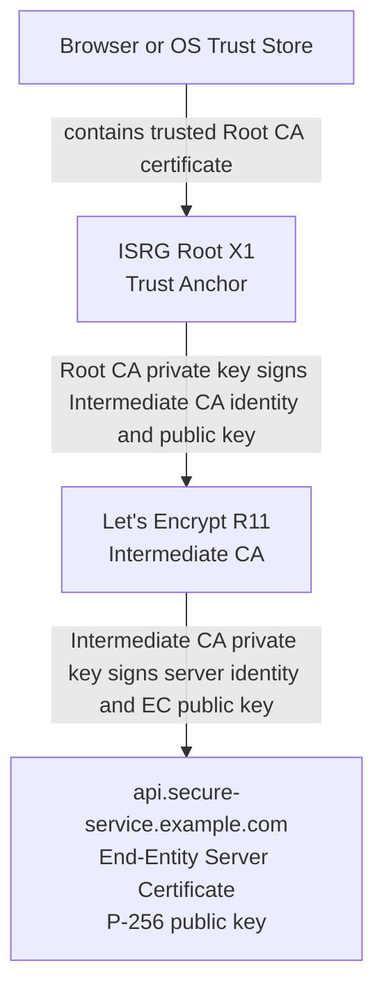
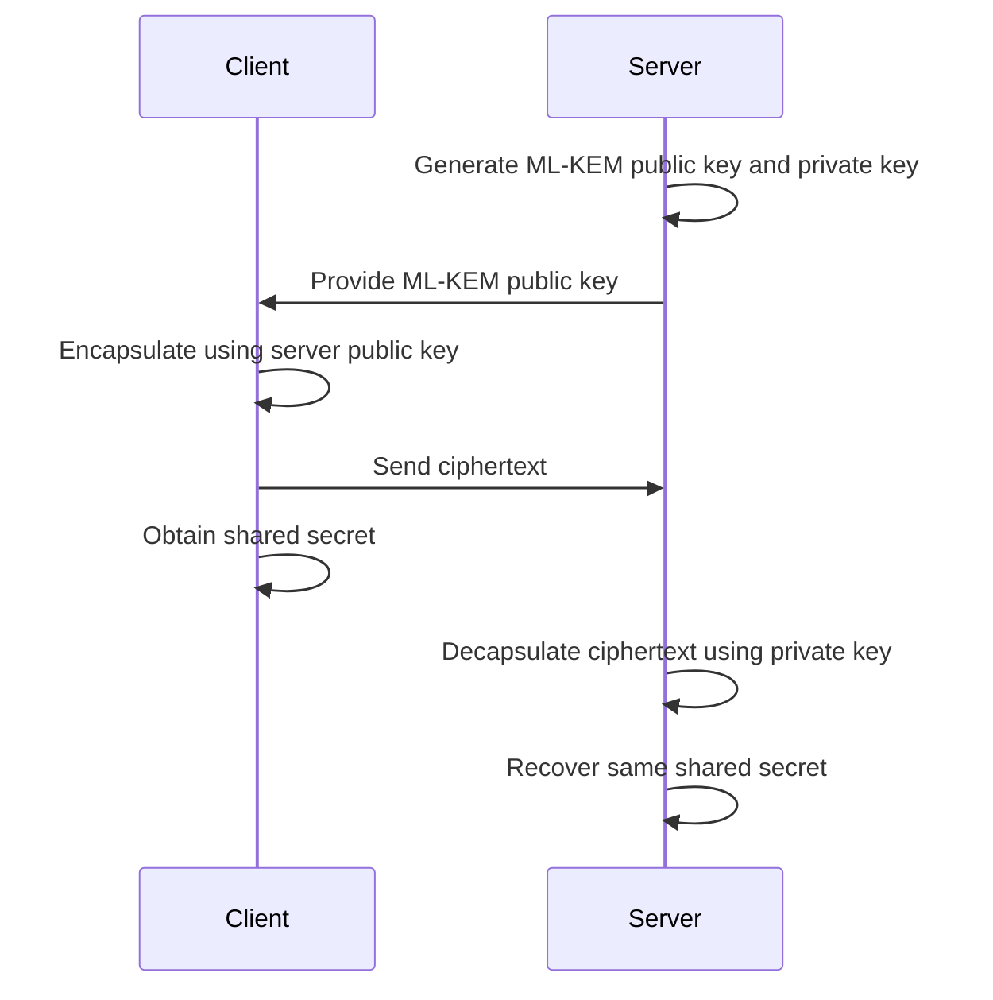

While studying Network Security and Applications(in Ajou University), I worked through a practical assignment that connected several topics that are often taught separately: asymmetric cryptography, key exchange, digital signatures, PKI, TLS cipher suites, and post-quantum cryptography.


The core question is simple:

> **If we compare a TLS 1.2 RSA-based session and a TLS 1.3 ECDHE/ECDSA-based session, what actually changes in the security design?**

---

# Example A and Example B

Before analyzing anything, it is important to understand the two examples.

## Example A: TLS 1.2 with RSA key exchange

| Field | Value |
|:--|:--|
| Server domain | `secure-bank.example.com` |
| TLS version | TLS 1.2 |
| Cipher suite | `TLS_RSA_WITH_AES_128_CBC_SHA256` |
| Key exchange | RSA |
| Authentication | RSA |
| Server certificate subject | `CN=secure-bank.example.com` |
| Issuer | DigiCert SHA2 Secure Server CA |
| Public key | RSA-2048 |
| Signature algorithm | SHA256withRSA |
| Validity | 2023-03-01 to 2025-03-01 |
| Certificate chain | `secure-bank.example.com` -> DigiCert SHA2 Secure Server CA -> DigiCert Global Root CA |

Example A represents a legacy-style TLS 1.2 configuration. The same RSA certificate key is closely tied to both server authentication and key establishment. The client generates a pre-master secret, encrypts it with the server's RSA public key, and sends it to the server. The server decrypts it with its RSA private key. After that, both sides derive symmetric keys.

The most important security consequence is that this structure does **not** provide forward secrecy. If an attacker records old traffic and later obtains the server's RSA private key, the attacker can decrypt the old RSA-encrypted pre-master secret and reconstruct the session keys.

## Example B: TLS 1.3 with X25519 and ECDSA

| Field | Value |
|:--|:--|
| Server domain | `api.secure-service.example.com` |
| TLS version | TLS 1.3 |
| Cipher suite | `TLS_AES_256_GCM_SHA384` |
| Key exchange | ECDHE with X25519 |
| Authentication | ECDSA |
| Server certificate subject | `CN=api.secure-service.example.com` |
| Issuer | Let's Encrypt R11 |
| Public key | EC 256-bit, P-256 |
| Signature algorithm | SHA256withECDSA |
| Validity | 2024-11-01 to 2025-02-01 |
| Certificate chain | `api.secure-service.example.com` -> Let's Encrypt R11 -> ISRG Root X1 |

Example B represents a modern TLS 1.3 configuration. The cipher suite only names the record protection algorithm and hash. Key exchange and authentication are handled separately in the handshake.

Here, X25519 is used for ephemeral Diffie-Hellman key exchange, while the ECDSA certificate is used for server authentication. These two roles are intentionally separated. The ECDSA private key proves the server's identity, but it is not used to directly decrypt the shared secret. The session secret comes from ephemeral X25519 key pairs generated for that connection.

This design provides forward secrecy: even if the server's long-term ECDSA private key is compromised later, old session keys cannot be reconstructed unless the ephemeral X25519 private values from those sessions were also compromised.

> The validity periods above are part of the assignment data. In a real browser validation flow, the certificate would be accepted only if the validation time is inside the certificate's validity window.

---

# 1. What a TLS Cipher Suite Really Means

At first glance, a cipher suite looks like a long algorithm name. However, the meaning of that name changed significantly from TLS 1.2 to TLS 1.3.

The difference between Example A and Example B is not just a version number difference. It reflects a structural change in how TLS organizes cryptographic responsibilities.

## 1.1 Decomposing the two cipher suites

| Component | Example A | Example B | Role |
|:--|:--|:--|:--|
| Key exchange | RSA | ECDHE with X25519 | Establishes the secret material used to derive session keys |
| Authentication | RSA | ECDSA | Proves that the server really owns the identity represented by the certificate |
| Symmetric encryption | AES-128-CBC | AES-256-GCM | Encrypts application data after the handshake |
| Integrity / authentication | HMAC-SHA256 | AES-256-GCM AEAD | Detects tampering and authenticates protected records |
| Hash / key schedule | TLS 1.2 PRF with SHA-256-related components | SHA-384 for HKDF and transcript authentication | Derives traffic secrets and authenticates handshake state |

Example A's cipher suite, `TLS_RSA_WITH_AES_128_CBC_SHA256`, carries several cryptographic decisions in one string:

- `RSA` describes the key exchange mechanism.
- `AES_128_CBC` describes the bulk encryption algorithm.
- `SHA256` is used for the MAC construction in this suite.

In this example, RSA is doing heavy work. It is not only related to the certificate's public key type, but also to the way the pre-master secret is transported from the client to the server.

Example B's cipher suite, `TLS_AES_256_GCM_SHA384`, is shorter and cleaner:

- `AES_256_GCM` describes the AEAD record protection algorithm.
- `SHA384` describes the hash used with HKDF and handshake authentication.

It does **not** say `X25519`.

It does **not** say `ECDSA`.

That is not missing information. That is the TLS 1.3 design.

## 1.2 Why TLS 1.3 cipher suites look different

In [RFC 5246](https://www.rfc-editor.org/rfc/rfc5246), TLS 1.2 cipher suites define a combination of cryptographic algorithms, including key exchange, bulk encryption, MAC, and PRF behavior. This is why TLS 1.2 cipher suite names often become long and tightly coupled.

For example:

```text
TLS_RSA_WITH_AES_128_CBC_SHA256
```

The name itself tells us that RSA key exchange is used, AES-128-CBC protects records, and a SHA-256-based MAC is involved.

TLS 1.3 changed this model. [RFC 8446](https://www.rfc-editor.org/rfc/rfc8446) separates authentication and key exchange from the record protection algorithm and hash. In other words, TLS 1.3 cipher suites no longer encode the full handshake design.

For example:

```text
TLS_AES_256_GCM_SHA384
```

This tells us how records are protected after secrets are derived, but it does not tell us which key exchange group was selected or which certificate signature algorithm was used.

The result is a cleaner separation:

| TLS area | TLS 1.2 style | TLS 1.3 style |
|:--|:--|:--|
| Key exchange | Often inside cipher suite name | Negotiated in handshake extensions and key share |
| Authentication | Often coupled with cipher suite/certificate type | Performed through certificate and `CertificateVerify` |
| Record encryption | Inside cipher suite name | Inside cipher suite name |
| Record integrity | MAC or AEAD depending on suite | AEAD only for normal confidentiality suites |
| Key derivation hash | Included as part of suite behavior | Explicitly named in cipher suite |

This is why Example B's cipher suite does not include ECDHE or ECDSA. X25519 appears in the TLS 1.3 key exchange flow, and ECDSA appears in the authentication flow.

---

# 2. Key Exchange: Transporting a Secret vs. Computing a Secret

The biggest conceptual difference between the two examples is how the session secret is established.

Example A transports a client-generated secret.

Example B computes a shared secret from both sides' ephemeral keys.

## 2.1 Example A: RSA key exchange in TLS 1.2

In the RSA key exchange flow, the client creates the pre-master secret and encrypts it with the server's RSA public key.



The key point is that the pre-master secret exists first on the client side and is then sent to the server in encrypted form.

That means the security of past sessions depends heavily on the long-term RSA private key. If the RSA private key is later exposed, recorded handshakes can become decryptable.

This is the classic "record now, decrypt later" problem.

## 2.2 Example B: X25519 ECDHE in TLS 1.3

In the X25519 ECDHE flow, the client and server do not send the shared secret directly. They send ephemeral public values and independently compute the same shared secret.



The shared secret is never transmitted over the network. Only public values are transmitted.

X25519 is an elliptic-curve Diffie-Hellman mechanism. At a high level, each side has a private scalar and a public value. Computing the public value from the private scalar is efficient, but recovering the private scalar from the public value is considered infeasible on classical computers because of the elliptic curve discrete logarithm problem.

This gives Example B forward secrecy. As defined in security terminology such as [RFC 4949](https://www.rfc-editor.org/rfc/rfc4949), forward secrecy protects past session keys even if a long-term private key is compromised later.

## 2.3 Why forward secrecy matters

Forward secrecy is not just an elegant cryptographic property. It directly changes the attack model.

In Example A:

1. An attacker records TLS traffic today.
2. The attacker obtains the server's RSA private key later.
3. The attacker decrypts the recorded `ClientKeyExchange`.
4. The attacker reconstructs the pre-master secret.
5. The attacker derives old session keys and decrypts old traffic.

In Example B:

1. An attacker records TLS traffic today.
2. The attacker obtains the server's ECDSA private key later.
3. The attacker can impersonate the server in some future scenarios if the certificate is still valid and other controls fail.
4. However, the attacker still cannot derive old X25519 shared secrets without the old ephemeral private values.

That difference is fundamental. Example B protects the confidentiality of past sessions much better than Example A.

---

# 3. Authentication: What the Certificate Proves

TLS authentication is often misunderstood as "the certificate encrypts the connection." That is not exactly correct.

A certificate does not simply make traffic encrypted. A certificate binds an identity to a public key, and a trusted CA signature allows the client to verify that binding.

## 3.1 What the digital signature inside a certificate means

The digital signature inside the server certificate is created by the issuing CA, not by the server itself.

In Example A, DigiCert SHA2 Secure Server CA signs information about:

- the domain `secure-bank.example.com`,
- the server's RSA-2048 public key,
- the certificate validity period,
- certificate extensions and metadata.

In Example B, Let's Encrypt R11 signs information about:

- the domain `api.secure-service.example.com`,
- the server's EC P-256 public key,
- the certificate validity period,
- certificate extensions and metadata.

This is the meaning of a certificate signature: the issuer says, "I vouch that this public key belongs to this subject under these certificate constraints."

The client validates this using the CA's public key and certificate path validation rules from [RFC 5280](https://www.rfc-editor.org/rfc/rfc5280).

## 3.2 RSA certificate key vs. ECDSA certificate key

Example A uses an RSA-2048 certificate public key.

Example B uses an EC 256-bit P-256 certificate public key.

These key sizes should not be compared directly by length. RSA and ECC are based on different mathematical problems:

| Algorithm family | Example | Security assumption |
|:--|:--|:--|
| RSA | RSA-2048 | Difficulty of integer factorization |
| ECC | P-256 ECDSA, X25519 ECDHE | Difficulty of elliptic curve discrete logarithm |

A 256-bit elliptic curve key can offer a security level comparable to, or stronger than, a much larger RSA key. [NIST SP 800-57 Part 1 Rev. 5](https://csrc.nist.gov/pubs/sp/800/57/pt1/r5/final) places RSA-2048 around the 112-bit security strength level, while P-256 is commonly associated with about 128-bit security strength.

This is why Example B can use a much shorter public key while still providing strong classical security.

## 3.3 Why digital signatures are necessary

Without certificate signatures, the client would have no reliable way to know whether the received public key actually belongs to the intended server.

Imagine this attack against Example A:

1. The user tries to connect to `secure-bank.example.com`.
2. A man-in-the-middle attacker intercepts the connection.
3. The attacker sends a fake certificate containing the attacker's RSA public key.
4. If the client does not validate the CA signature and domain identity, it accepts the fake key.
5. The client encrypts the pre-master secret with the attacker's RSA public key.
6. The attacker decrypts it, derives the session keys, and can read or modify traffic.

This is why certificate validation is not a minor implementation detail. It is the mechanism that prevents public-key substitution.

---

# 4. PKI Trust Chain: Who Signs Whom?

Public Key Infrastructure is a chain of delegated trust.

A browser does not manually know every website's public key. Instead, it trusts a set of Root CAs stored in the browser or operating system trust store. Those Root CAs can sign Intermediate CAs, and Intermediate CAs can issue end-entity server certificates.

## 4.1 Example A certificate chain



The Root CA is the trust anchor. The browser already trusts it because it is included in the trust store.

The Intermediate CA is delegated by the Root CA. It is allowed to issue server certificates under specific rules.

The End-Entity certificate is the actual server certificate presented during the TLS handshake.

## 4.2 Example B certificate chain



The structure is the same even though the organizations and key types differ.

## 4.3 Why Root CAs usually do not issue server certificates directly

Root CA private keys are extremely sensitive. If a Root CA private key is compromised, the damage can affect every certificate chain anchored at that Root CA.

This is why Root CAs usually delegate certificate issuance to Intermediate CAs:

- **Root key protection:** Root CA keys can be kept offline or under stricter operational controls.
- **Operational separation:** Intermediate CAs handle day-to-day issuance, renewal, and revocation workflows.
- **Damage containment:** If an Intermediate CA is compromised, that Intermediate CA can be revoked without necessarily replacing the entire Root CA ecosystem.

This design is a practical security engineering tradeoff. It does not remove all risk, but it limits the blast radius of routine certificate operations.

## 4.4 How a browser trusts Example A

For `secure-bank.example.com`, the browser's logical validation process is:

1. Receive the server certificate chain during the TLS handshake.
2. Check that the server certificate identity matches `secure-bank.example.com`.
3. Check that the certificate is within its validity period.
4. Check whether revocation information indicates that the certificate or CA certificate has been revoked, using mechanisms such as CRL or [OCSP](https://www.rfc-editor.org/rfc/rfc6960).
5. Verify the server certificate signature using the Intermediate CA public key.
6. Verify the Intermediate CA certificate signature using the Root CA public key.
7. Confirm that the Root CA is present in the local trust store.

For service identity verification, modern TLS identity checking focuses on subjectAltName entries rather than relying only on the Common Name. [RFC 9525](https://www.rfc-editor.org/rfc/rfc9525) is a useful reference for service identity verification in TLS.

If all these checks pass, the browser treats the public key in the server certificate as the legitimate public key for that domain.

---

# 5. Record Protection: CBC + HMAC vs. AEAD

After the handshake, TLS protects application data through the record layer.

This is where symmetric cryptography becomes the main workhorse.

## 5.1 Example A: AES-128-CBC with HMAC-SHA256

Example A uses AES-128-CBC for encryption and HMAC-SHA256 for integrity.

CBC mode encrypts blocks of plaintext using an initialization vector and chaining between blocks. However, CBC by itself does not authenticate the data. That is why TLS 1.2 CBC-based suites use a separate MAC.

At a high level:

```text
plaintext -> MAC calculation -> padding -> AES-CBC encryption -> TLS record
```

The client and server need separate key material for encryption and MAC. This increases the amount of protocol machinery, and historically CBC-mode TLS required careful handling to avoid padding-oracle-style side channels.

This does not mean every TLS 1.2 CBC session is automatically broken. It means the construction is more fragile than modern AEAD-based designs.

## 5.2 Example B: AES-256-GCM as AEAD

Example B uses AES-256-GCM.

GCM is an AEAD mode: Authenticated Encryption with Associated Data. AEAD provides confidentiality and integrity in one construction. It encrypts the plaintext and also produces an authentication tag.

At a high level:

```text
plaintext + associated data -> AES-GCM -> ciphertext + authentication tag
```

In TLS 1.3, normal record protection suites use AEAD algorithms. This reduces the need for separate MAC handling and makes the record protection model simpler.

## 5.3 Why this matters

The difference between CBC + HMAC and AEAD is not only aesthetic. It affects protocol complexity.

Example A has separate encryption and MAC concepts.

Example B integrates encryption and authentication through AEAD.

That is one reason Example B better represents the modern TLS design philosophy: fewer legacy options, fewer fragile combinations, and a clearer split between handshake authentication, key establishment, and record protection.

---

# 6. Quantum Threat Diagnosis

The next question is about the future.

If a large-scale cryptographically relevant quantum computer exists, what happens to these two examples?

The answer depends on which cryptographic component we are discussing.

## 6.1 Public-key components: RSA, ECDHE, and ECDSA

RSA, finite-field Diffie-Hellman, and elliptic-curve cryptography are all threatened by [Shor's Algorithm](https://doi.org/10.1109/SFCS.1994.365700).

| Component | Example A | Example B | Quantum vulnerability | Reason |
|:--|:--|:--|:--|:--|
| Key exchange | RSA | ECDHE with X25519 | Both vulnerable | RSA relies on factorization; X25519 relies on elliptic curve discrete logarithm |
| Authentication | RSA | ECDSA | Both vulnerable | RSA signatures and ECDSA signatures rely on public-key assumptions broken by Shor's Algorithm |

This is a critical point:

> Example B is clearly better in the classical TLS security model, but it is not post-quantum secure.

Forward secrecy protects against later compromise of long-term classical private keys. It does not protect against an attacker who can solve the underlying elliptic curve discrete logarithm problem from recorded public key shares using a sufficiently powerful quantum computer.

In other words, X25519 ECDHE is excellent for classical forward secrecy, but it is still based on ECC.

## 6.2 Symmetric components: AES-128 and AES-256

Symmetric encryption is affected differently.

[Grover's Algorithm](https://doi.org/10.1145/237814.237866) gives a quadratic speedup for brute-force search. This reduces the effective security margin of symmetric keys, but it does not destroy symmetric cryptography in the same direct way that Shor's Algorithm threatens RSA and ECC.

| Component | Example A | Example B | Quantum impact |
|:--|:--|:--|:--|
| Symmetric encryption | AES-128-CBC | AES-256-GCM | Grover's Algorithm reduces brute-force cost |
| Practical mitigation | Increase key size | Already uses AES-256 | AES-256 gives a larger margin against Grover-style search |

This is why AES-256 is often considered more comfortable for long-term security planning. It does not make the whole TLS session post-quantum secure, but it improves the symmetric-key security margin.

---

# 7. Where Kyber/ML-KEM Fits in TLS

When discussing post-quantum cryptography, it is easy to say "replace RSA and ECC with Kyber." That sentence is too broad.

Kyber, standardized by NIST as [ML-KEM in FIPS 203](https://csrc.nist.gov/pubs/fips/203/final), is a **Key Encapsulation Mechanism**.

That means it is designed for key establishment, not for digital signatures.

## 7.1 What a KEM does

A KEM is used to establish a shared secret over an insecure channel.

Conceptually:



In TLS terms, this corresponds to the part of the handshake that establishes secret material for later traffic keys.

So ML-KEM can replace or supplement:

- RSA-based transport of the pre-master secret,
- ECDHE-based shared secret generation,
- hybrid key exchange designs such as X25519 plus ML-KEM.

## 7.2 The mathematical difference

RSA and ECC are based on number-theoretic problems:

- RSA depends on the difficulty of factoring large integers.
- ECC depends on the difficulty of solving elliptic curve discrete logarithms.

Kyber/ML-KEM is based on module lattice problems, especially Module-Learning With Errors.

At a high level, Module-LWE asks an attacker to recover hidden secret information from noisy linear algebra structures. The important point is that the known quantum attacks against RSA and ECC do not transfer directly to Module-LWE in the same devastating way.

That does not mean "mathematically impossible to break forever." It means current public cryptanalysis does not know an efficient quantum algorithm comparable to Shor's Algorithm for breaking ML-KEM's underlying problem.

## 7.3 What Kyber cannot replace

Kyber/ML-KEM is not a signature algorithm.

Therefore, it cannot directly replace:

- RSA signatures in Example A,
- ECDSA signatures in Example B,
- CA signatures inside X.509 certificate chains.

For post-quantum authentication, we need post-quantum digital signature algorithms. NIST standardized [ML-DSA in FIPS 204](https://csrc.nist.gov/pubs/fips/204/final) and [SLH-DSA in FIPS 205](https://csrc.nist.gov/pubs/fips/205/final) for digital signatures.

This means a post-quantum TLS migration has at least two different jobs:

| TLS role | Classical examples | PQC direction |
|:--|:--|:--|
| Key establishment | RSA key exchange, X25519 ECDHE | ML-KEM or hybrid ECDHE + ML-KEM |
| Server authentication | RSA, ECDSA | ML-DSA, SLH-DSA, or other standardized PQ signature schemes |
| Record encryption | AES-CBC, AES-GCM, ChaCha20-Poly1305 | Continue using strong symmetric AEAD, with enough key length |

This is why the post-quantum transition is not one-dimensional. Replacing the key exchange is not enough if the authentication chain still depends on RSA or ECDSA.

---

# 8. Classical Security vs. Post-Quantum Readiness

Now we can evaluate the two examples more carefully.

## 8.1 Why Example B is better today

I would choose Example B as the stronger current security configuration.

Not simply because TLS 1.3 is newer, but because of several concrete security properties.

First, Example B provides forward secrecy through ephemeral X25519 ECDHE. Example A's RSA key exchange does not.

Second, Example B uses AEAD record protection through AES-256-GCM. Example A uses AES-128-CBC plus a separate HMAC construction, which is more legacy and more fragile.

Third, Example B separates key exchange, authentication, and record protection more cleanly. This makes the protocol design easier to reason about and more adaptable.

Fourth, Example B uses a P-256 ECDSA certificate, which gives strong classical security with smaller keys and efficient signatures compared with RSA-2048.

## 8.2 What Example A still has going for it

Example A should not be described as "nothing works."

If implemented correctly, RSA-2048, AES-128-CBC, HMAC-SHA256, and a valid PKI chain can still represent a meaningful classical security configuration in a limited legacy context.

The problem is that it lacks modern security properties:

- no forward secrecy in RSA key exchange,
- CBC-mode record protection instead of AEAD,
- tighter coupling of key exchange and authentication,
- weaker long-term migration story.

For a high-value target such as a banking domain, the absence of forward secrecy is especially hard to accept.

## 8.3 Why Example B is easier to migrate toward PQC

TLS 1.3's cleaner separation makes it easier to introduce post-quantum key establishment.

In a TLS 1.3-like structure, X25519 can be replaced or combined with ML-KEM without redefining the entire cipher suite naming model. The cipher suite can continue to describe record protection, while the handshake negotiates key establishment separately.

This does not automatically solve post-quantum authentication. Certificates and CA signatures still need a migration path toward PQ signature algorithms.

But structurally, Example B is closer to the model that crypto-agile TLS deployments need.

---

# 9. Summary Table

| Question | Example A | Example B |
|:--|:--|:--|
| TLS version | TLS 1.2 | TLS 1.3 |
| Cipher suite style | Combined key exchange, encryption, MAC naming | AEAD + hash naming |
| Key exchange | RSA transport of pre-master secret | X25519 ECDHE shared secret computation |
| Authentication | RSA certificate/signature | ECDSA certificate/signature |
| Forward secrecy | No | Yes, in the classical model |
| Record protection | AES-128-CBC + HMAC-SHA256 | AES-256-GCM AEAD |
| Certificate chain | DigiCert intermediate under DigiCert root | Let's Encrypt intermediate under ISRG root |
| Classical security posture | Legacy but understandable | Modern and stronger |
| Quantum risk | RSA key exchange and RSA authentication vulnerable | X25519 and ECDSA vulnerable |
| PQC key establishment path | Replace RSA key transport with ML-KEM-style KEM | Replace or hybridize X25519 with ML-KEM |
| PQC authentication path | Replace RSA signatures with PQ signatures | Replace ECDSA signatures with PQ signatures |

---

# 10. What I Learned

This assignment made TLS feel less like a black box.

The most valuable lesson was that "encryption" is not one mechanism. A secure TLS connection is built from several roles:

- key establishment,
- server authentication,
- certificate path validation,
- symmetric record encryption,
- record integrity,
- key derivation,
- algorithm negotiation,
- revocation and identity checking.

If one of these roles is misunderstood, the entire security analysis becomes vague.

For example, saying "RSA is used" is not enough. RSA can be used for key exchange, for digital signatures, or as a public key inside a certificate. Those are different roles with different security consequences.

Likewise, saying "Kyber replaces RSA" is not precise enough. ML-KEM can replace key establishment mechanisms, but it cannot replace digital signatures. For signatures, we need algorithms such as ML-DSA or SLH-DSA.

My final conclusion is:

> **Example B is the better modern TLS configuration, but neither Example A nor Example B is fully post-quantum secure.**

Example B wins in today's classical security model because it provides forward secrecy, uses AEAD, and follows the cleaner TLS 1.3 separation between key establishment, authentication, and record protection.

However, from a long-term post-quantum perspective, both examples still depend on public-key assumptions that will need migration. The future TLS stack will likely combine strong symmetric AEAD, post-quantum or hybrid key establishment, and post-quantum authentication through new certificate and signature ecosystems.

That is the real engineering challenge: not only selecting stronger algorithms, but moving an entire trust infrastructure safely.
